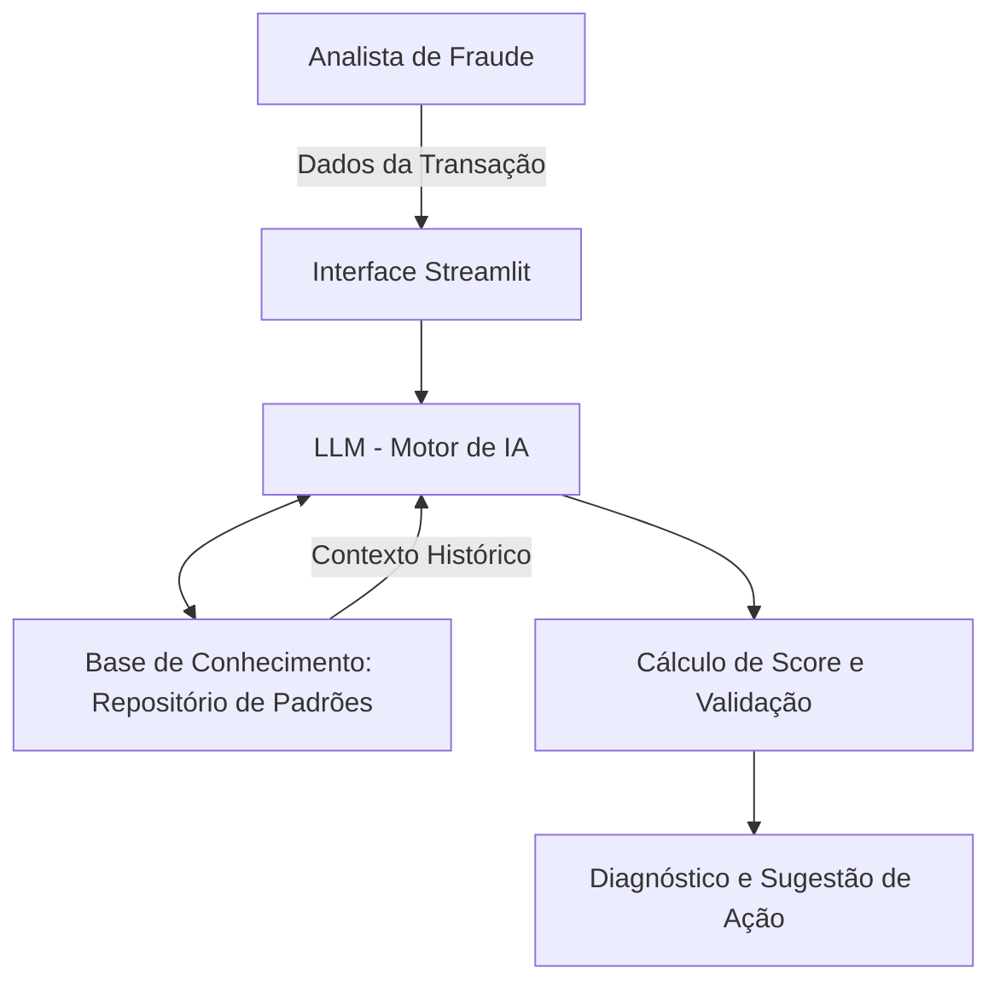

# 🛡️ Documentação do Agente: FraudGuard AI

## 📊 Caso de Uso

### 🔍 Problema
> **Qual problema financeiro seu agente resolve?**

O **FraudGuard AI** ataca a ineficiência e o prejuízo financeiro causados pelo **Chargeback (Estorno)** não detectado em tempo real. No cenário atual, analistas de fraude enfrentam um volume massivo de transações e dependem de regras estáticas que geram muitos "falsos positivos" ou deixam passar padrões complexos de comportamento.

O problema central é a **reatividade**: muitas vezes a fraude só é percebida após o prejuízo consolidado, gerando custos operacionais elevados e perda de receita.

### 💡 Solução
> **Como o agente resolve esse problema de forma proativa?**

O agente atua como um **Especialista de Risco Consultivo** utilizando a técnica de **RAG (Retrieval-Augmented Generation)**. Ele processa cada transação cruzando os dados em tempo real com o [**Repositório de Padrões de Fraude**](https://github.com/vbiscaia-ai/Padroes_de_Fraudes_em_Estornos), que contém a base de conhecimentos histórica do projeto.

A solução resolve o problema de forma proativa através de:
* **Cálculo de Score de Risco (%):** Atribuição imediata de uma probabilidade de fraude baseada em variáveis críticas (Valor, Hora e Local).
* **Diagnóstico Fundamentado:** A IA justifica a suspeita (Ex: *"Transação de madrugada com valor 3x acima do ticket médio da categoria"*), eliminando a "caixa-preta" das decisões automatizadas.
* **Sugestão de Ações Imediatas:** O agente sugere o **Bloqueio**, **Revisão Manual** ou **Aprovação**, acelerando o tempo de resposta da equipe de segurança.

### 👥 Público-Alvo
> **Quem vai usar esse agente?**

O agente foi projetado estrategicamente para três perfis principais:
1.  **Analistas de Risco e Fraude (Nível 1 e 2):** Que necessitam de suporte inteligente para triagem rápida de transações suspeitas no dia a dia bancário.
2.  **Gestores de Operações Financeiras:** Que buscam reduzir o **KPI de Chargeback** e aumentar a eficiência operacional do time de monitoramento.
3.  **Recrutadores e Gestores de Tecnologia (Bootcamp Bradesco/DIO):** Como uma prova de conceito (PoC) de como unir **Ciência de Dados (ETL)** com **IA Generativa** para gerar valor real de negócio.

---

## 🎭 Persona e Tom de Voz

### 🆔 Nome do Agente
**FraudGuard AI** (Inspirado na robustez da **BIA** e focado em segurança de dados).

### 🧠 Personalidade
> **Como o agente se comporta? (ex: consultivo, direto, educativo)**

O agente é **Analítico, Consultivo e Vigilante**. Ele atua como um parceiro sênior de suporte à decisão. Não se limita a dar respostas curtas; ele apresenta justificativas baseadas em dados e padrões históricos, mantendo uma postura de "alerta constante", mas sem ser alarmista, sempre focando na mitigação de riscos financeiros.

### 🗣️ Tom de Comunicação
> **Formal, informal, técnico, acessível?**

O tom é **Profissional e Técnico-Acessível**. Ele utiliza terminologia do setor bancário e de dados (ex: *Chargeback, Score de Risco, RAG, Outliers*) de forma clara, garantindo que a comunicação seja eficiente para um ambiente de operação de risco, onde a precisão é mais importante que a informalidade.

### 📝 Exemplos de Linguagem
* **Saudação:** "Sistema FraudGuard inicializado. Monitorando transações em tempo real. Como posso auxiliar na análise de risco agora?"
* **Confirmação:** "Entendido. Cruzando os dados da transação com os [**Padrões de Fraude do Repositório**](https://github.com/vbiscaia-ai/Padroes_de_Fraudes_em_Estornos) para gerar o diagnóstico."
* **Análise de Risco:** "Atenção: Identificada correlação de 85% com padrão de fraude 'Madrugada High-Ticket'. Recomendo revisão imediata."
* **Erro/Limitação:** "Não identifiquei este padrão específico na minha base de conhecimento atual, mas com base nas heurísticas gerais de segurança, sugiro cautela com..."

---

## Arquitetura

### 📊 Fluxo de Arquitetura (RAG)

Abaixo, o fluxo de funcionamento do **FraudGuard AI**, desde a entrada da transação até a validação do score de risco:

### 🛠️ Componentes do Sistema

| Componente | Descrição |
| :--- | :--- |
| **Interface** | Dashboard interativo desenvolvido em **Streamlit**, permitindo a entrada de dados transacionais e visualização de scores de risco em tempo real. |
| **LLM** | **GPT-4o / Google Gemini** (via API), configurado com Engenharia de Prompt para atuar como um Especialista de Risco Bancário. |
| **Base de Conhecimento** | Estrutura **RAG (Retrieval-Augmented Generation)** consumindo arquivos Markdown e CSV com os [**Padrões de Fraude Identificados**](https://github.com/vbiscaia-ai/Padroes_de_Fraudes_em_Estornos). |
| **Validação** | Camada de **Lógica Heurística** que cruza a resposta da IA com os "Padrões de Ouro" (ex: 100% de fraude pós-expediente) para evitar alucinações. |

---

## 🛡️ Segurança e Anti-Alucinação

### Estratégias Adotadas

* [x] **Context-Check (RAG):** O agente é instruído a priorizar os [**Padrões de Fraude Identificados**](https://github.com/vbiscaia-ai/Padroes_de_Fraudes_em_Estornos) sobre o conhecimento genérico da LLM.
* [x] **Citação de Fontes:** Toda análise de risco deve indicar qual arquivo ou insight serviu de base (ex: *"Baseado no Heatmap de Estornos Pós-Expediente"*).
* [x] **Admissão de Incerteza:** Quando uma transação não possui correlação clara com os padrões históricos, o agente deve admitir a falta de dados e sugerir "Revisão Manual Humana" em vez de chutar um score.
* [x] **Trava de Risco Extremo:** Implementação de lógica rígida para o padrão de 100% de fraude em horários pós-expediente, impedindo que a IA subestime esse risco específico.
* [x] **Foco Operacional:** O agente não realiza transações financeiras reais; sua função é estritamente de suporte à decisão e análise de risco (Read-only Advisor).

## ⚠️ Limitações Declaradas

### O que o agente NÃO faz?

*  **Execução de Transações:** O agente é estritamente um **Adviser (Consultor)**. Ele não possui permissão para realizar estornos, bloqueios de conta ou transferências de fundos de forma autônoma.
*  **Substituição do Juízo Humano:** As recomendações (Bloqueio/Aprovação) são baseadas em probabilidades estatísticas e padrões históricos. A decisão final e a responsabilidade legal permanecem com o **Analista de Fraude**.
*  **Análise de Dados Sensíveis (LGPD):** O agente foi projetado para processar metadados transacionais (ID da Loja, Valor, Horário). Ele **não processa nem armazena** CPFs, senhas ou dados pessoais identificáveis dos clientes.
*  **Garantia de 0% de Falso Positivo:** Embora utilize RAG para alta precisão, a IA pode sinalizar transações atípicas, mas legítimas, como suspeitas (especialmente em períodos sazonais não mapeados na base).
*  **Previsão de Novos Golpes (Zero-Day):** O agente identifica fraudes baseadas em **padrões conhecidos** e armazenados no repositório. Golpes inéditos que não apresentem correlação com a base histórica podem não ser detectados com o score máximo.

---

### 🎓 Projeto de Conclusão

Este projeto é o artefato final do **Bradesco - GenAI & Dados** em parceria com a **DIO**.

**Objetivo Educacional:** Demonstrar a aplicação prática de **IA Generativa** e **Engenharia de Dados** em um cenário real de missão crítica do setor bancário. O projeto une a análise técnica de fraudes em estornos com a arquitetura moderna de **RAG (Retrieval-Augmented Generation)** para suporte à decisão.

**Desenvolvido por:** [Victor Biscaia]

**Instituições:** Bradesco & Digital Innovation One (DIO)

**Data:** Abril de 2026

**Local:** Salvador, BA - Brasil 🇧🇷

---
